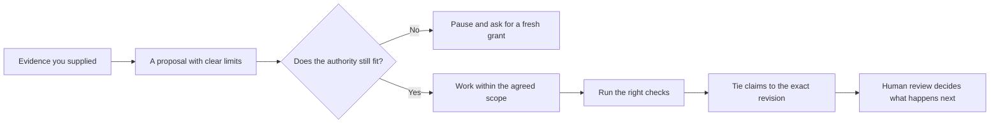

# Hi, I'm Mike.

I'm an author, hands-on builder, and AI Craft leader from New Zealand. I use
Codex and other AI tools to turn ambitious ideas into real projects—and to
learn what makes AI-assisted work actually useful.

I care about making this capability accessible to people who do not code, and making it
more reliable, reviewable, and safe for people building serious systems.

This profile is where I publish the practical results: plain-English guides,
small runnable patterns, and evidence you can inspect for yourself.

Away from the technical work, I write stories where fantasy, science fiction,
and the apocalypse collide. You can
[meet The Mana Influx Series on Amazon](https://www.amazon.com/The-Mana-Influx/dp/B0CNPWZ745).

## How The Pieces Work Together

Here is the simple loop behind the reliability projects:

AI can do a lot of the proposing and making, but it should not have to carry
the responsibility alone. The surrounding workflow keeps sources, authority,
validation, evidence, and consequential decisions in human hands.

## Pick A Place To Start

| If this is the problem... | Start here | What you will see |
| --- | --- | --- |
| Stop an agent from exceeding its authority | [Complete reliable-agent workflow](https://github.com/TheDarkniteFalls/local-assistant-reliability-lab#see-it-all-come-together) | Protected writes, grant replay, and changed scope are rejected |
| Prove a receipt targets the reviewed revision | [EvidenceGate v1 reference run](https://github.com/TheDarkniteFalls/evidencegate#quick-start) | Stale heads, omitted paths, and protected paths fail |
| Keep answers inside supplied evidence | [Context Boundary Examples](https://github.com/TheDarkniteFalls/context-boundary-examples#run) | Unsupported answers and missing citations fail |
| Preserve a scarce evaluation holdout | [Sealed Evaluation Pattern](https://github.com/TheDarkniteFalls/sealed-evaluation-pattern) | Early reveal, sealed access, changed output, and unretired gold fail |
| Check whether a generated system connects | [Generated-System QA Pattern](https://github.com/TheDarkniteFalls/generated-system-qa-pattern) | Stale data, unreachable goals, missing services, and illegal journeys fail |
| Compare model routes on equivalent work | [Model Workload Telemetry](https://github.com/TheDarkniteFalls/model-workload-telemetry) | Shared task classes, failure buckets, time, tokens, scores, and revision burden stay separate |

Everything here uses small synthetic examples, runs without needing a model,
and is honest about what a pass does and does not prove.

## Lessons From The Work

The projects are different, but the same practical lessons keep surviving:

- The model is rarely the whole product. The harness around it owns sources,
  validation, authority, state changes, and evidence.
- A useful workflow and a permitted action are separate questions. Good agents
  need to finish real work without treating one approval as unlimited power.
- No-model fixtures are often the fastest way to prove an AI workflow's
  boundaries before model quality and runtime variability enter the picture.
- One named end-to-end check can be more useful than a large test count when a
  person needs to know whether the important path still works.
- Metadata should earn its place by preventing a named retrieval failure, not
  merely by making a schema look comprehensive.

I keep the fuller, still-evolving set of conclusions in
[Field Notes From Building With AI](FIELD_NOTES.md), including the next public
patterns that look worth turning into small runnable examples.

## Maybe My Strongest Project

[EvidenceGate](https://github.com/TheDarkniteFalls/evidencegate) began with a
simple belief: AI-assisted work should leave a receipt. It has grown into a
hardened reference implementation for revision-bound receipts from
human-reviewed agent work, with adversarial tests, separately written Python
and Node consumers, an unsigned in-toto attestation profile ready for standard
signing, and a reproducible reviewer-study protocol.

Unsigned receipts are not authenticated, and the reviewer study provides a
method rather than pretending the result already exists.

## Choose Your Path

### I want to turn an idea into something real

- Start with [Build with Codex: A Plain-English Handbook](https://github.com/TheDarkniteFalls/agent-operator-handbook)
  to shape an idea into a bounded project without needing to read code.
- Ask Codex to draft the [Agent Project Card](https://github.com/TheDarkniteFalls/agent-operator-handbook/blob/main/templates/AGENT_PROJECT_CARD.md)
  so you can decide the destination, protected areas, and approval points.
- Use [Verify Without Reading Code](https://github.com/TheDarkniteFalls/agent-operator-handbook/blob/main/guides/VERIFY_WITHOUT_READING_CODE.md)
  to check the visible result, evidence, and uncertainty in plain language.

### I am building a game with Codex

- Start with the [Game Project Instructions for Coding Agents](https://github.com/TheDarkniteFalls/codex-project-instructions-starter/tree/main/examples/game-project)
  to define sources of truth, protected assets and saves, approval gates,
  exact checks, and the human playtest that still has to judge the result.
- The starter is engine-neutral and can be adapted for Godot, Unity, Unreal,
  or a custom engine.

### I want to strengthen an AI-assisted build

- Start with [EvidenceGate](https://github.com/TheDarkniteFalls/evidencegate)
  for a hardened, inspectable way to bind claims, checks, file scope, and human
  review to one Git revision.
- Use the [Local Assistant Reliability Lab](https://github.com/TheDarkniteFalls/local-assistant-reliability-lab)
  to watch the complete workflow come together or find a focused pattern for
  the reliability problem you are facing.
- Explore focused examples for [context boundaries](https://github.com/TheDarkniteFalls/context-boundary-examples),
  [action authority](https://github.com/TheDarkniteFalls/agent-action-authority-examples),
  [model-output validation](https://github.com/TheDarkniteFalls/local-model-reliability-example),
  and [repeatable workflow QA](https://github.com/TheDarkniteFalls/green-spine-qa-pattern).
- Preserve scarce test material with the [Sealed Evaluation Pattern](https://github.com/TheDarkniteFalls/sealed-evaluation-pattern),
  check generated content with the [Generated-System QA Pattern](https://github.com/TheDarkniteFalls/generated-system-qa-pattern),
  and compare model routes with [Model Workload Telemetry](https://github.com/TheDarkniteFalls/model-workload-telemetry).

## What Connects the Work

The goal is to make AI-assisted building more accessible without lowering the
standard of thought, control, or proof.

- **Make capability accessible.** People should be able to direct ambitious
  projects in ordinary language and understand the decisions that matter.
- **Keep humans responsible.** Models can propose and produce; people retain
  authority over consequential actions and protected areas.
- **Make results inspectable.** Reliable work has explicit boundaries,
  validation, evidence, and a clear handoff rather than only a persuasive chat.

## How I Work

I use these approaches on working websites, tools, workflows, local-model
experiments, and creative projects. I am also the author of The Mana Influx
Series and Soul Spark Reclaimer.

I try to make real things rather than explore purely theoretical problems or
hype — I like leaving behind something another person can actually use.
